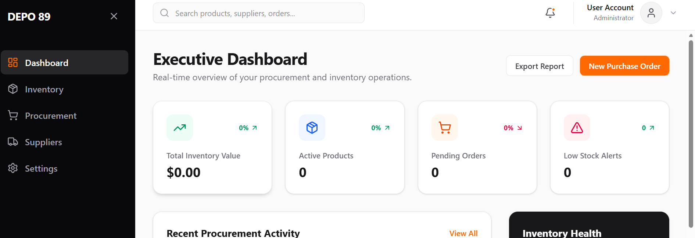
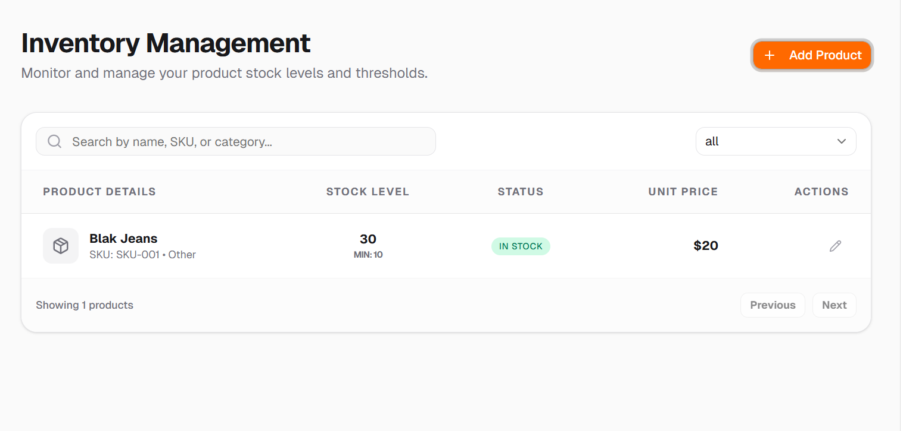
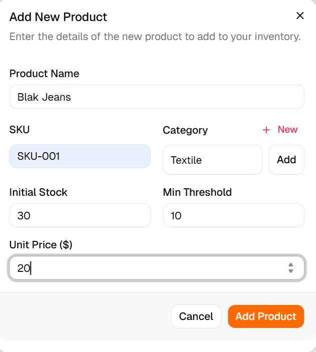

# DEPO 89: Inventory & Procurement Management System



A professional React-based dashboard for managing industrial inventory and procurement workflows. Built with a focus on real-time intelligence, clean UI, and robust data management.

## 🚀 Key Features

- **Real-time Dashboard**: Overview of total stock value, low stock alerts, pending orders, and active products.
- **Dynamic Analytics**: Visual representation of stock movements using Recharts (Inflow/Outflow).
- **Inventory Management**: Comprehensive table view with searching, filtering by category, and stock status tracking (In Stock, Low Stock, Out of Stock).
- **Dynamic Category Creation**: Ability to add new product categories on-the-fly directly within the add product section.
- **Multi-Currency Support**: Support for 7+ currencies (USD, EUR, GBP, JPY, INR, PLN, TRY) with a global switcher and automatic price formatting.
- **Live Stock Updates**: Interactive dialogs to update current stock levels with automatic status adjustment.
- **Procurement Integration**: Seamless transition from inventory alerts to procurement forms.
- **Modern UI/UX**: Built with Tailwind CSS, Lucide icons, and Motion for smooth animations.

## 📸 Screenshots

### Inventory Management

*Track and manage your entire stock with advanced filtering and search.*

### Add New Product

*Quickly add products and create new categories on the fly.*

## 🛠️ Tech Stack & Implementation

### Core Technologies
- **React 19**: Leveraging the latest features for modern component architecture.
- **TypeScript**: Ensuring type safety across products, orders, and statuses.
- **Vite**: High-performance build tool for a fast development experience.
- **Tailwind CSS**: Utility-first CSS for responsive and consistent styling.

### Strategic Implementation
- **Feature-First Architecture**: Organized by functional domains (`dashboard`, `inventory`, `procurement`) for better scalability.
- **State Management**: Utilized React hooks (`useState`, `useMemo`) for efficient local state and optimized filtering logic.
- **Shared UI Library**: Integrated with **Shadcn UI** components (Table, Dialog, Badge, Input, Select) for a high-quality, professional interface.
- **Data Visualization**: Integrated **Recharts** to provide actionable insights into warehouse operations.
- **Motion & Interactions**: Enhanced user experience with **Motion** for subtle transitions and interactive state changes.

## 🏁 How to Run Locally

**Prerequisites:** Node.js installed on your machine.

1. **Clone and Install**:
   ```bash
   npm install
   ```
2. **Launch Development Server**:
   ```bash
   npm run dev
   ```
3. **Build for Production**:
   ```bash
   npm run build
   ```

## 📂 Project Structure

- `src/features/`: Core business logic and feature-specific components.
- `src/components/ui/`: Reusable, atomic UI components (Shadcn).
- `src/types/`: Centralized TypeScript interfaces for consistent data structures.
- `src/lib/`: Utility functions and helper methods.

